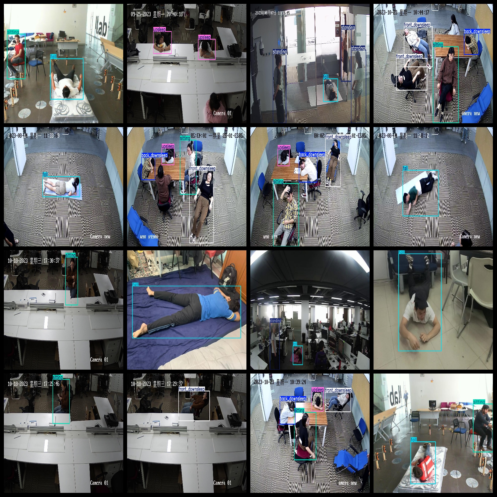

# Person Behavior Detection Dataset 6549 imagesVOC+YOLO format

The Human Behavior Detection Dataset contains 6549 images in VOC+YOLO format.

Dataset format: Pascal VOC format + YOLO format (the txt file does not contain the split path, it only contains jpg images and corresponding VOC format xml files and yolo format txt files)

Number of images (jpg file count): 6549

Number of XML Files: 6549

Number of annotations (number of txt files): 6549

Number of categories: 6

The Github repository is: datasets_sl

Annotation class names: ["back_downsleep","fall","front_downsleep","sitting","standing","upsleep"]

Number of boxes labeled in each category:

The number of back-down sleep frames is 1855.

Falling frames = 3399

The number of frames to preserve in the front downsleep is 1925.

sitting frame count = 1808

The number of standing frames is 2633.

Upsleep Frames = 1687

Total Frames: 13,307

Number of images per category:

Back_downsleep occupies 1422 images.

Fall occupies 3,379 pictures:

The front_downsleep occupies a total of 1596 images.

Number of pictures sitting = 1389

Standing occupancy image count = 1456

Upsleep occupies 1290 images.

Image resolution: Multi-resolution images such as 1920x1080, 640x480, etc.

Use the labeling tool: labelImg

Dataset Augmentation: Yes

Rules for annotation: Draw a rectangle around the category.

Important note: The dataset does not have been divided into training, validation, and testing sets.

Special Disclaimer: This dataset does not guarantee the accuracy of the trained models or weight files.

Annotation and image details are as follows:

## Images

---

Here is a pay link on Stripe (https://buy.stripe.com/3cs8yP7sY87d0vu9AB). Please contact me lonlonago@foxmail.com after funding $89, and I will send you a complete data files, thank you!

